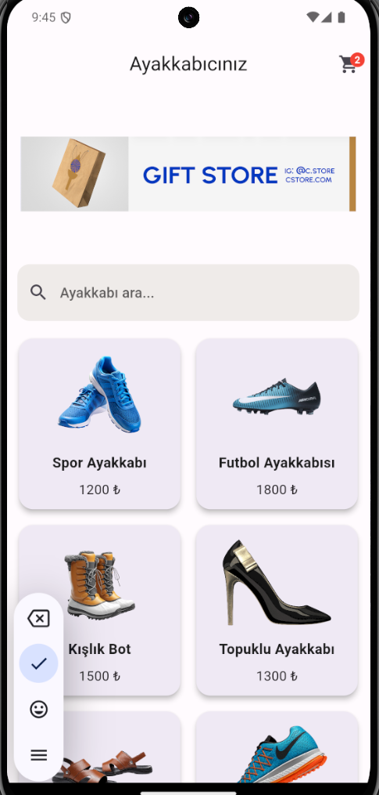
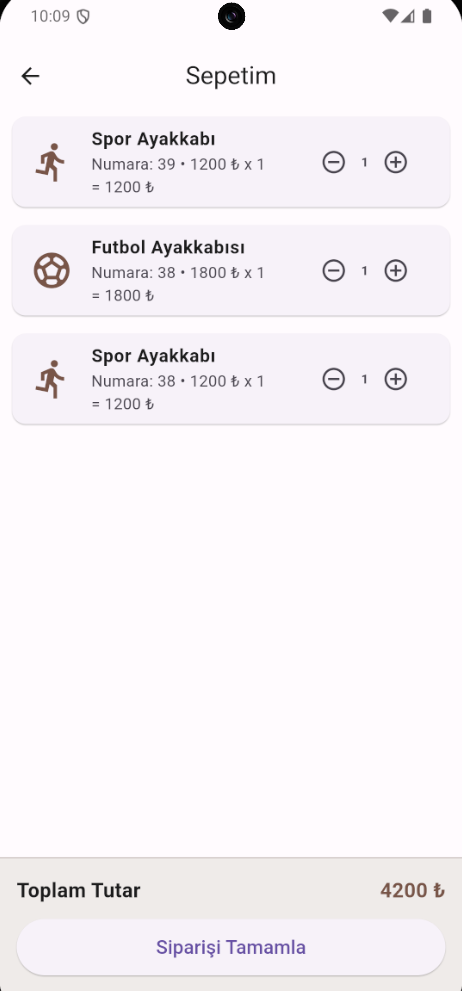
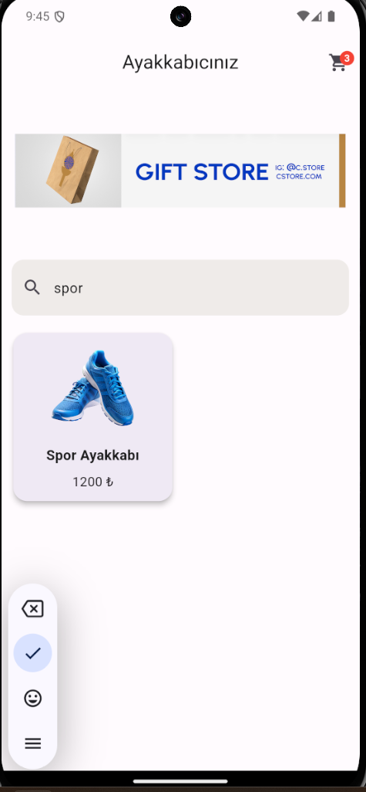
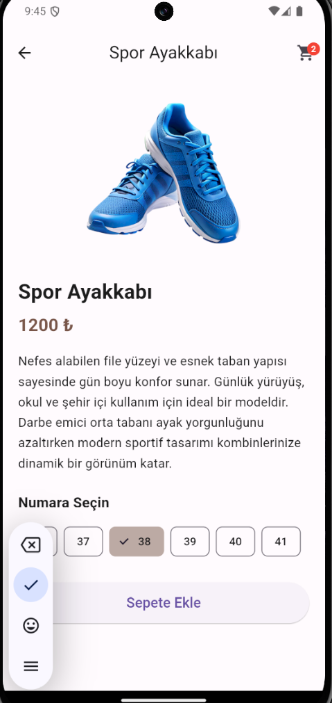

# Ayakkabıcınız - Flutter Mini Katalog Uygulaması

Bu proje Flutter kullanılarak geliştirilmiş basit bir **ürün katalog uygulamasıdır.**

## Özellikler

- Ürün katalog ekranı
- GridView ile kart tabanlı tasarım
- Ürün detay sayfası
- Sepete ürün ekleme
- Ayakkabı numarası seçme
- Sepet ekranı
- Navigator ile sayfa geçişleri
- Basit state yönetimi

---

# Uygulama Ekranları

## Ana Sayfa

---

## Ürün Detay Sayfası

---

## Sepet Sayfası

## Ürün Arama

---

## Numara Seçme

---

## Sepete Ürün Ekleme

