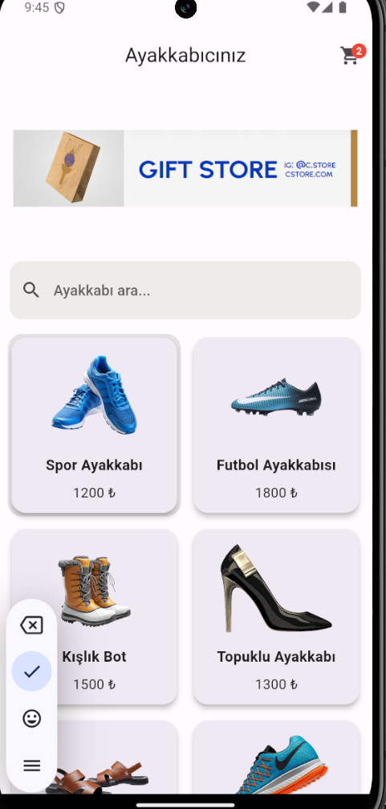
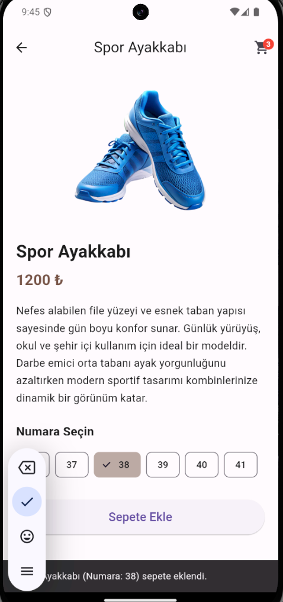
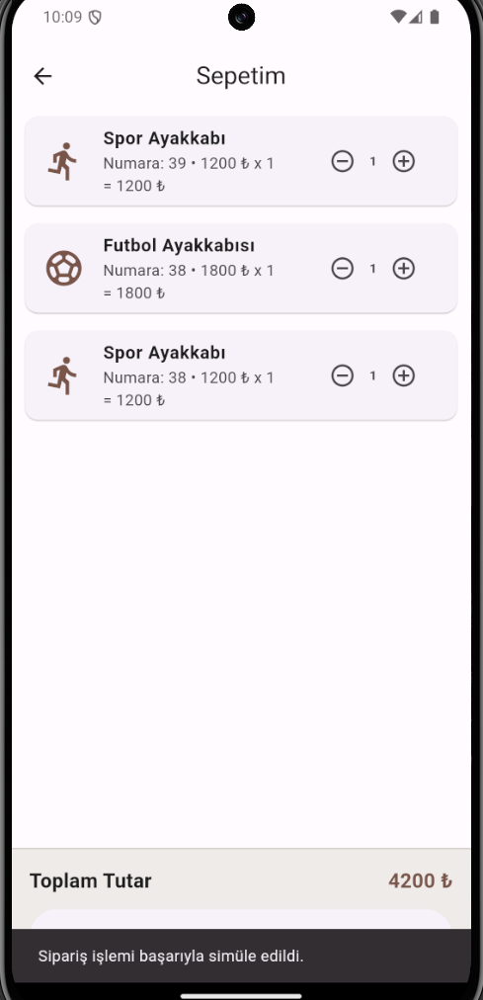

# Ayakkabıcınız - Flutter Mini Katalog Uygulaması

Bu proje Flutter kullanılarak geliştirilmiş basit bir **ürün katalog uygulamasıdır.**

## Özellikler

- Ürün katalog ekranı
- GridView ile kart tabanlı tasarım
- Ürün detay sayfası
- Sepete ürün ekleme
- Ayakkabı numarası seçme
- Sepet ekranı
- Navigator ile sayfa geçişleri
- Basit state yönetimi
  

---

## Kullanılan Flutter Sürümü

Flutter 3.19.0 • channel stable • https://github.com/flutter/flutter.git
Framework • revision bae5e49bc2 (2 years, 1 month ago) • 2024-02-13 17:46:18 -0800    
Engine • revision 04817c99c9
Tools • Dart 3.3.0 • DevTools 2.31.1

---

## Projeyi Çalıştırma

1. Flutter SDK kurulu olmalıdır.
2. Repository klonlanır:

git clone https://github.com/Neet7272/ayakkabiciniz-flutter.git

3. Proje klasörüne girilir:

cd ayakkabiciniz-flutter

4. Paketler yüklenir:

flutter pub get

5. Uygulama çalıştırılır:

flutter run
---

# Uygulama Ekranları

## Ana Sayfa

---

## Ürüne Tıklama

---

## Ürün Arama

---

## Numara Seçme

---

## Sepete Ekleme

---

## Sepet Sayfası

---

## Sipariş Verme

